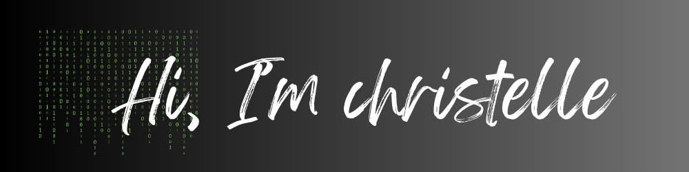

👋 Hello, I'm a tech professional with a diverse background:

🖥️ 10+ years in software engineering, honing my skills in crafting robust and scalable solutions.

🔒 Equipped with a Master's degree in Cybersecurity, I prioritize building secure and resilient systems.

📈 Experience in product management, I bring a strategic mindset to problem-solving and product development.

📊 Proficient in data science, I leverage insights to drive data-driven decision-making.

 

📌 Pinned Repositories
---

  

  

